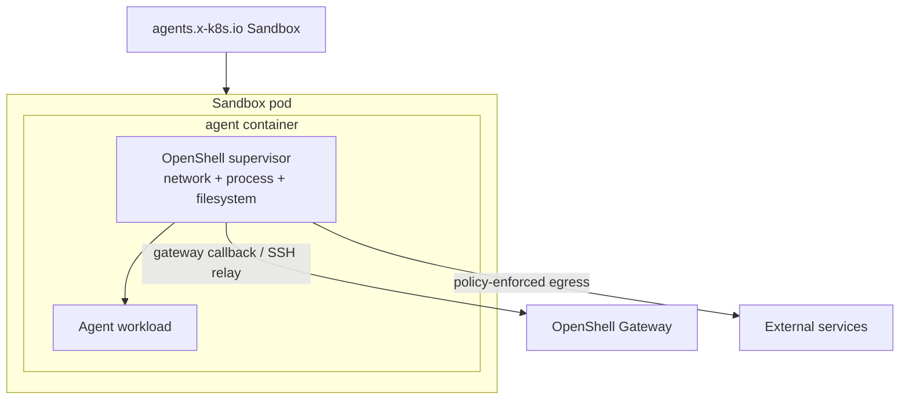
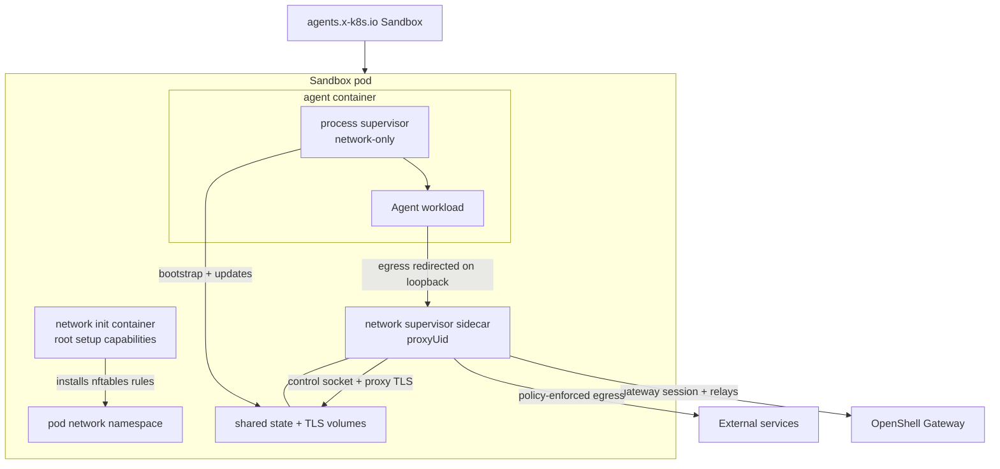

Kubernetes sandbox pods can run the OpenShell supervisor in `combined` or
`sidecar` topology. Choose the topology based on which controls you need inside
the pod and how much privilege your cluster allows on the agent container.

## Choose a Topology

The default `combined` topology preserves the full OpenShell enforcement model.
Use `sidecar` only when you accept network-focused enforcement in exchange for a
lower-privilege agent container.

| Topology | Use when | Main tradeoff |
|---|---|---|
| `combined` | You need OpenShell network, filesystem, and process controls in the sandbox workload. | The agent container carries the Linux capabilities the supervisor needs. |
| `sidecar` | You need the agent container to run as non-root without added Linux capabilities, and network policy is the primary control. | Privilege-dropping and supervisor mount isolation do not run in the agent container. |

## Privilege Model

The long-running container permissions differ by topology:

| Topology | Pod or container | UID/GID | Privilege escalation | Capabilities | Result |
|---|---|---|---|---|---|
| `combined` | Agent container, which also runs the supervisor | Not forced by topology | Not explicitly disabled by the driver | Adds `SYS_ADMIN`, `NET_ADMIN`, `SYS_PTRACE`, and `SYSLOG`; adds `SETUID`, `SETGID`, and `DAC_READ_SEARCH` when user namespaces are enabled | Full supervisor controls run in the agent container. |
| `sidecar` | Agent container, process-only supervisor (`network-only`) | `sandbox_uid:sandbox_gid` | `false` | Drops `ALL` | Agent and workload run without added Linux capabilities. |
| `sidecar` | Network supervisor sidecar | `proxyUid:sandbox_gid` | `false` | Drops `ALL` | Long-running proxy sidecar is also non-root without added capabilities. |

Short-lived setup containers still have the permissions needed to prepare the
pod:

| Topology | Setup container | UID/GID | Privilege escalation | Capabilities | Purpose |
|---|---|---|---|---|---|
| `combined` | Supervisor install init container | `0` | Not set | Not set | Copies the supervisor binary into the agent container volume. |
| `sidecar` | Network init container | `0` | `false` | Drops `ALL`; adds `NET_ADMIN`, `NET_RAW`, `CHOWN`, and `FOWNER` | Installs pod-local nftables rules and prepares shared sidecar state. |

## Combined Topology

Combined topology is the original Kubernetes mode and remains the default. The
agent container starts the OpenShell supervisor, and the supervisor launches the
workload after applying sandbox setup.



Combined topology keeps these controls in one supervisor path:

- Network endpoint and L7 policy enforcement.
- Filesystem policy enforcement.
- Process and binary identity checks.
- Privilege drop into the sandbox user.
- Gateway relay, SSH sessions, exec, and file sync.

Because the supervisor performs network namespace setup and process/filesystem
controls from the agent container, Kubernetes grants that container elevated
Linux capabilities. Use this mode when you need the complete OpenShell sandbox
contract and your cluster policy permits those capabilities.

## Sidecar Topology

Sidecar topology splits the supervisor into a network sidecar and a
low-privilege process supervisor in the agent container.



The pod contains these OpenShell-managed pieces:

| Component | Runs as | Purpose |
|---|---|---|
| Network init container | Root with setup capabilities | Installs pod-level nftables rules and prepares shared sidecar state. |
| Network sidecar | `supervisor.sidecar.proxyUid` | Runs the proxy, enforces network policy, owns gateway authentication and the gateway session, and serves local policy/provider state over the sidecar control socket. |
| Agent container | Resolved sandbox UID/GID | Runs the process supervisor and launches the user workload. |

In this topology, the agent container defaults to `runAsNonRoot: true`,
`allowPrivilegeEscalation: false`, and `capabilities.drop: ["ALL"]`. The
long-running network sidecar always drops all Linux capabilities. The root init
container keeps the setup capabilities needed to configure pod networking.

Sidecar mode preserves gateway session behavior, including SSH connectivity,
because the network sidecar owns the gateway session and bridges relay requests
to the process supervisor's local SSH socket. The agent container does not get a
gateway endpoint, gateway TLS material, or the sandbox bootstrap token in the
default sidecar path.

<Warning>
Sidecar mode runs the process supervisor in `network-only` mode. OpenShell still
enforces network endpoint and L7 policy through the sidecar, and the process
supervisor applies Landlock filesystem policy and child seccomp filters where
the kernel/runtime supports them. The process supervisor does not perform
root-to-sandbox privilege dropping because Kubernetes starts the container as
the sandbox UID/GID, and it does not perform supervisor identity mount
isolation because gateway credentials are not mounted into the agent container.
Sidecar pods use `shareProcessNamespace: true` so the network sidecar can
resolve workload process and binary identity through `/proc/<entrypoint-pid>`.
</Warning>

## Credential Exposure

Sidecar topology keeps gateway credentials in the network sidecar. The agent
container does not mount the projected ServiceAccount token used for sandbox
token bootstrap, does not mount the sandbox client TLS secret, and does not get
gateway callback environment variables.

The network sidecar serves the policy and workload-facing provider environment
over a Unix control socket in the shared sidecar state volume. The process
supervisor connects to that socket at startup, receives bootstrap state, and
then listens for provider-environment updates after settings polls. Future child
processes can see refreshed provider env without giving the agent container
gateway authentication material. This does not mutate the environment of the
already-running workload entrypoint. Use `combined` topology when you need the
full single-supervisor enforcement path; use additional runtime isolation when
you need a stronger container boundary around sidecar workloads.

## RuntimeClass Isolation

Sidecar topology pairs well with runtime classes such as gVisor or Kata
Containers when the cluster supports them. A sandboxed runtime strengthens the
container boundary while OpenShell focuses on network policy enforcement from
the sidecar.

Runtime classes do not re-enable the OpenShell privilege-drop or supervisor
mount-isolation controls that sidecar mode relaxes. Use them as an additional
workload boundary, not as a replacement for the combined topology's full
supervisor controls.

You can set a default runtime class in the Kubernetes driver configuration or
override it per sandbox with driver config:

```shell
openshell sandbox create \
  --driver-config-json '{"kubernetes":{"pod":{"runtime_class_name":"kata-containers"}}}' \
  -- claude
```

## Enable Sidecar Mode

For direct gateway TOML configuration, set the Kubernetes driver fields:

```toml
[openshell.drivers.kubernetes]
topology = "sidecar"

[openshell.drivers.kubernetes.sidecar]
proxy_uid = 1337
```

`proxy_uid` must be a non-root UID and must not match the sandbox UID.
The network init container exempts this UID from proxy redirection so the
sidecar can reach the gateway.

When the Helm chart renders `gateway.toml`, set the equivalent chart values:

```yaml
supervisor:
  topology: sidecar
  sidecar:
    proxyUid: 1337
```

Leave `topology` unset, or set it to `combined`, to keep the original
single-container supervisor path. For Helm installs, leave
`supervisor.topology` unset or set it to `combined`.

## Next Steps

- To install OpenShell on Kubernetes, refer to [Setup](/kubernetes/setup).
- To configure gateway authentication, refer to [Access Control](/kubernetes/access-control).
- To review the driver fields, refer to [Gateway Configuration File](/reference/gateway-config).
