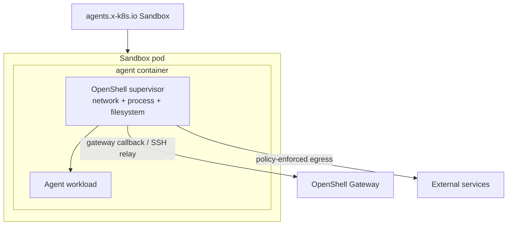
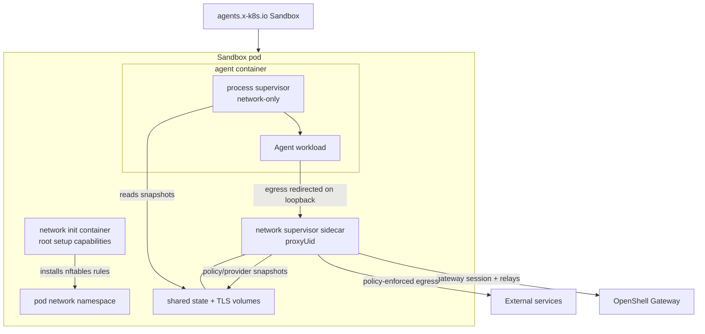
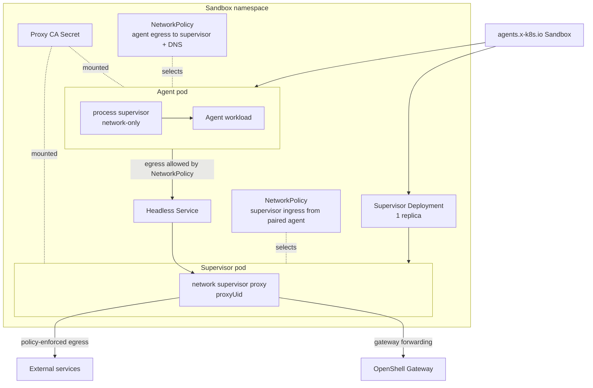

Kubernetes sandbox pods can run the OpenShell supervisor in `combined`,
`sidecar`, or `proxy-pod` topology. Choose the topology based on which controls
you need inside the pod, how much privilege your cluster allows on the agent
container, and whether the cluster enforces Kubernetes NetworkPolicies.

## Choose a Topology

The default `combined` topology preserves the full OpenShell enforcement model.
Use `sidecar` only when you accept network-focused enforcement in exchange for a
lower-privilege agent container.

| Topology | Use when | Main tradeoff |
|---|---|---|
| `combined` | You need OpenShell network, filesystem, and process controls in the sandbox workload. | The agent container carries the Linux capabilities the supervisor needs. |
| `sidecar` | You need the agent container to run as non-root without added Linux capabilities, and network policy is the primary control. | The process supervisor is network-only, so filesystem/process controls do not run in the agent container. |
| `proxy-pod` | You need network enforcement to run outside the agent pod and your cluster enforces Kubernetes NetworkPolicies. | Requires a NetworkPolicy-enforcing CNI or controller; the agent process supervisor is network-only. |

## Privilege Model

The long-running container permissions differ by topology:

| Topology | Pod or container | UID/GID | Privilege escalation | Capabilities | Result |
|---|---|---|---|---|---|
| `combined` | Agent container, which also runs the supervisor | Not forced by topology | Not explicitly disabled by the driver | Adds `SYS_ADMIN`, `NET_ADMIN`, `SYS_PTRACE`, and `SYSLOG`; adds `SETUID`, `SETGID`, and `DAC_READ_SEARCH` when user namespaces are enabled | Full supervisor controls run in the agent container. |
| `sidecar` | Agent container, process-only supervisor (`network-only`) | `sandbox_uid:sandbox_gid` | `false` | Drops `ALL` | Agent and workload run without added Linux capabilities. |
| `sidecar` | Network supervisor sidecar | `proxyUid:sandbox_gid` | `false` | Drops `ALL` | Long-running proxy sidecar is also non-root without added capabilities. |
| `proxy-pod` | Agent pod container, process-only supervisor (`network-only`) | `sandbox_uid:sandbox_gid` | `false` | Drops `ALL` | Agent and workload run without added Linux capabilities in their own pod. |
| `proxy-pod` | Supervisor pod container, network proxy only | `proxyUid:sandbox_gid` | `false` | Drops `ALL` | Long-running proxy runs outside the agent pod without added capabilities. |

Short-lived setup containers still have the permissions needed to prepare the
pod:

| Topology | Setup container | UID/GID | Privilege escalation | Capabilities | Purpose |
|---|---|---|---|---|---|
| `combined` | Supervisor install init container | `0` | Not set | Not set | Copies the supervisor binary into the agent container volume. |
| `sidecar` | Network init container | `0` | `false` | Drops `ALL`; adds `NET_ADMIN`, `NET_RAW`, `CHOWN`, and `FOWNER` | Installs pod-local nftables rules and prepares shared sidecar state. |
| `proxy-pod` | Supervisor install init container | `0` | Not set | Not set | Copies the supervisor binary into the agent pod volume. |
| `proxy-pod` | Proxy CA install init container | `0:sandbox_gid` | `false` | Drops `ALL` | Copies proxy CA material into the agent pod TLS volume. |

## Combined Topology

Combined topology is the original Kubernetes mode and remains the default. The
agent container starts the OpenShell supervisor, and the supervisor launches the
workload after applying sandbox setup.



Combined topology keeps these controls in one supervisor path:

- Network endpoint and L7 policy enforcement.
- Filesystem policy enforcement.
- Process and binary identity checks.
- Privilege drop into the sandbox user.
- Gateway relay, SSH sessions, exec, and file sync.

Because the supervisor performs network namespace setup and process/filesystem
controls from the agent container, Kubernetes grants that container elevated
Linux capabilities. Use this mode when you need the complete OpenShell sandbox
contract and your cluster policy permits those capabilities.

## Sidecar Topology

Sidecar topology splits the supervisor into a network sidecar and a
low-privilege process supervisor in the agent container.



The pod contains these OpenShell-managed pieces:

| Component | Runs as | Purpose |
|---|---|---|
| Network init container | Root with setup capabilities | Installs pod-level nftables rules and prepares shared sidecar state. |
| Network sidecar | `supervisor.proxyUid` | Runs the proxy, enforces network policy, owns gateway authentication and the gateway session, and writes proxy TLS plus local policy/provider snapshots. |
| Agent container | Resolved sandbox UID/GID | Runs the process supervisor and launches the user workload. |

In this topology, the agent container defaults to `runAsNonRoot: true`,
`allowPrivilegeEscalation: false`, and `capabilities.drop: ["ALL"]`. The
long-running network sidecar always drops all Linux capabilities. The root init
container keeps the setup capabilities needed to configure pod networking.

Sidecar mode preserves gateway session behavior, including SSH connectivity,
because the network sidecar owns the gateway session and bridges relay requests
to the process supervisor's local SSH socket. The agent container does not get a
gateway endpoint, gateway TLS material, or the sandbox bootstrap token in the
default sidecar path.

<Warning>
Sidecar mode runs the process supervisor in `network-only` mode. OpenShell still
enforces network endpoint and L7 policy through the sidecar, but the process
supervisor does not apply Landlock filesystem policy, process privilege
dropping, or process/binary identity checks. Use `combined` topology when you
need those controls in the same supervisor path.
</Warning>

## Proxy-Pod Topology

Proxy-pod topology moves network enforcement and gateway forwarding into a
separate supervisor Deployment with one pod. The agent pod runs the process
supervisor and reaches the supervisor through a per-sandbox headless Service.



OpenShell creates these per-sandbox resources:

- Agent pod labeled `openshell.ai/sandbox-role=agent`.
- Supervisor Deployment with one pod labeled `openshell.ai/sandbox-role=supervisor`.
- Headless Service for the supervisor pod.
- Proxy CA Secret shared through mounts.
- NetworkPolicy that limits agent egress to the supervisor pod and DNS.
- NetworkPolicy that accepts supervisor ingress only from the paired agent pod.

The supervisor Deployment has a controlling `Sandbox` ownerReference so
Kubernetes garbage collection removes it when the sandbox is deleted. The
Deployment recreates the supervisor pod if the pod is deleted independently.

<Warning>
Proxy-pod topology requires NetworkPolicy enforcement to work as OpenShell
expects. The target cluster must have a policy-enforcing CNI or equivalent
NetworkPolicy controller before deploying this topology. Without enforcement,
the agent pod is not forced through its paired supervisor proxy, so the
agent-to-supervisor isolation policy is only declarative.
</Warning>

## Credential Exposure

Sidecar topology keeps gateway credentials in the network sidecar. The agent
container does not mount the projected ServiceAccount token used for sandbox
token bootstrap, does not mount the sandbox client TLS secret, and does not get
gateway callback environment variables.

The network sidecar writes local snapshots that the process supervisor needs:

- A protobuf policy snapshot.
- A workload-facing provider environment snapshot.

The provider snapshot contains the environment variables OpenShell intentionally
injects into the workload. The process supervisor loads it at startup and
watches for newer revisions that the network sidecar writes after settings
polls, so future child processes can see refreshed provider env without giving
the agent container gateway authentication material. This does not mutate the
environment of the already-running workload entrypoint. Use `combined` topology
when you need full process/filesystem enforcement in the same supervisor path;
use additional runtime isolation when you need a stronger container boundary
around network-only sidecar workloads.

Proxy-pod topology uses a separate supervisor pod for gateway-facing network
enforcement and forwards the agent pod through that supervisor Service. The
proxy-pod agent process supervisor preserves gateway session behavior while
network egress is isolated by the per-sandbox NetworkPolicies described above.

## RuntimeClass Isolation

RuntimeClass isolation can add a stronger container boundary, but support
depends on the topology and runtime:

- `proxy-pod` has been tested with Kata Containers and gVisor and is functional
  when the cluster enforces NetworkPolicies.
- `sidecar` is experimental with Kata Containers and is known to fail with
  gVisor because sidecar mode depends on pod-local network rule setup.

Runtime classes do not re-enable OpenShell filesystem and process controls when
sidecar and proxy-pod modes use `network-only` process supervision. Use
RuntimeClass isolation as an additional workload boundary, not as a replacement
for combined topology.

You can set a default runtime class in the Kubernetes driver configuration or
override it per sandbox with driver config:

```shell
openshell sandbox create \
  --driver-config-json '{"kubernetes":{"pod":{"runtime_class_name":"kata-containers"}}}' \
  -- claude
```

## Enable Alternate Topologies

For direct gateway TOML configuration, set the Kubernetes driver fields for
sidecar mode:

```toml
[openshell.drivers.kubernetes]
supervisor_topology = "sidecar"
proxy_uid = 1337
```

Set `supervisor_topology="proxy-pod"` to use proxy-pod mode:

```toml
[openshell.drivers.kubernetes]
supervisor_topology = "proxy-pod"
proxy_uid = 1337
```

`proxy_uid` must be a non-root UID and must not match the sandbox UID. In
sidecar mode, the network init container exempts this UID from proxy
redirection so the sidecar can reach the gateway. In proxy-pod mode, the same
value is used as the non-root UID for the proxy supervisor pod created by the
Deployment.

When the Helm chart renders `gateway.toml`, set the equivalent chart values for
sidecar mode:

```yaml
supervisor:
  topology: sidecar
  proxyUid: 1337
```

Set `supervisor.topology=proxy-pod` to use proxy-pod mode:

```yaml
supervisor:
  topology: proxy-pod
  proxyUid: 1337
```

Leave `supervisor_topology` unset, or set it to `combined`, to keep the
original single-container supervisor path. For Helm installs, leave
`supervisor.topology` unset or set it to `combined`.

## Next Steps

- To install OpenShell on Kubernetes, refer to [Setup](/kubernetes/setup).
- To configure gateway authentication, refer to [Access Control](/kubernetes/access-control).
- To review the driver fields, refer to [Gateway Configuration File](/reference/gateway-config).
