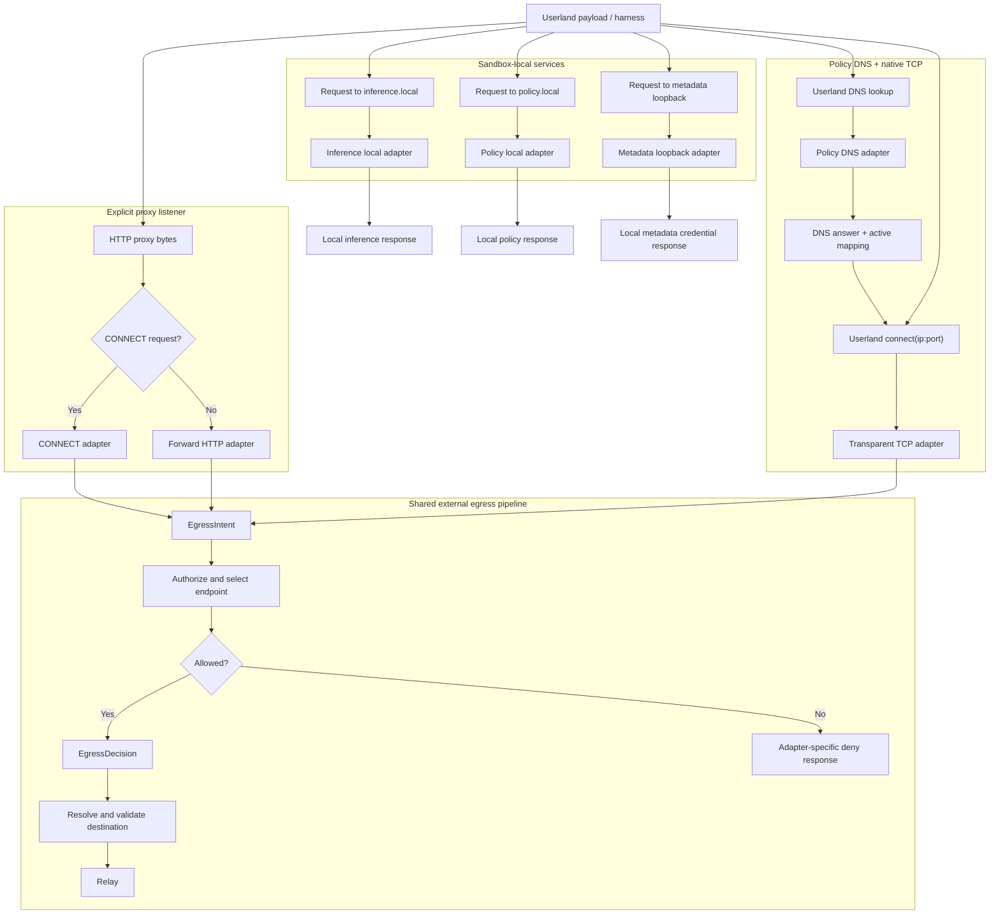
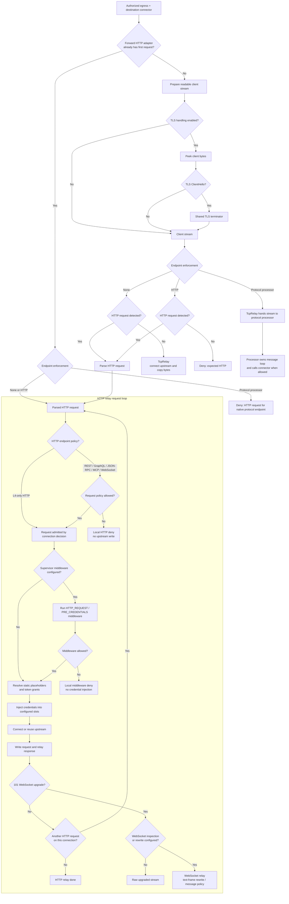
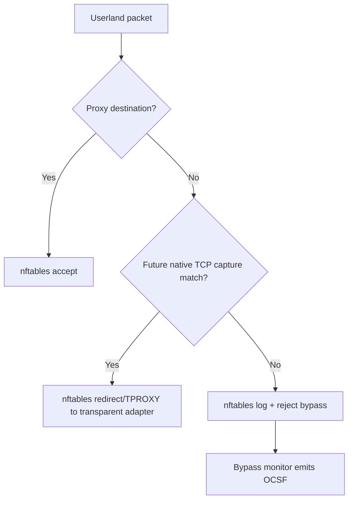

---
authors:
  - "@johntmyers"
state: draft
links:
  - https://github.com/NVIDIA/OpenShell/issues/1107
  - https://github.com/NVIDIA/OpenShell/pull/1083
  - https://github.com/NVIDIA/OpenShell/pull/1151
  - https://github.com/NVIDIA/OpenShell/pull/1286
  - https://github.com/NVIDIA/OpenShell/pull/1511
  - https://github.com/NVIDIA/OpenShell/pull/1738
  - https://github.com/NVIDIA/OpenShell/pull/2027
  - https://github.com/NVIDIA/OpenShell/pull/1865
  - https://github.com/NVIDIA/OpenShell/pull/1938
---

# RFC 0005 - Sandbox Proxy Egress Adapter Model

<!--
See rfc/README.md for the full RFC process and state definitions.
-->

## Summary

Refactor sandbox egress around one shared authorization and relay pipeline.
CONNECT, forward HTTP, native TCP capture, policy DNS, `inference.local`,
`policy.local`, and metadata loopback should become narrow adapters that
translate userland entry points into common runtime intents. Policy evaluation,
destination validation, supervisor middleware, credential injection,
request-body rewrite, WebSocket handling, protocol processing, and upstream
dialing should happen behind shared boundaries.

The codebase has already moved in this direction by splitting networking into
`openshell-supervisor-network` and process/netns work into
`openshell-supervisor-process`. This RFC proposes the next internal boundary:
make proxy entry mechanisms pluggable without duplicating authorization,
destination validation, or relay behavior.

Supporting detail lives in:

- [Current shape appendix](current-shape.md)
- [Technical design appendix](technical-design.md)
- [Implementation plan](implementation-plan.md)

## Motivation

The sandbox proxy supports several connection surfaces: explicit CONNECT,
forward HTTP, local inference and policy APIs, metadata loopback, TLS
termination, REST, GraphQL, JSON-RPC, MCP, and WebSocket inspection,
credential injection, supervisor middleware, and nftables-backed bypass
detection. These features are valuable, but changes to policy and enforcement
still tend to touch multiple entry paths.

The risk is asymmetric enforcement. A security fix can be added to CONNECT and
missed in forward HTTP; endpoint metadata can be selected differently from the
logged policy; a credential path can gain request-body or WebSocket support
without the same behavior existing in another relay mode.

The target shape separates three concerns:

- **Adapters** describe how userland reached the networking component.
- **Authorization** decides whether the egress is allowed and what endpoint
  behavior applies.
- **Relays** own bytes, credentials, protocol parsing, and upstream dialing.

This also prepares the proxy for future deployment modes. Today the proxy runs
inside the sandbox supervisor process. The networking leaf can already run in a
network-only mode, and a future standalone binary or sidecar should be possible
if it implements the same userland surfaces, gateway APIs, and policy
enforcement contracts.

## Non-goals

- Replace CONNECT with forward proxy as the only explicit proxy mode.
- Add SOCKS support.
- Add HTTP/2 L7 parsing in this refactor. Inspected HTTP paths should continue
  to reject unsupported h2c upgrades instead of silently upgrading to raw
  traffic.
- Redesign provider credential storage.
- Reintroduce iptables as the sandbox packet filtering backend.
- Use eBPF connect hooks for transparent capture. Native TCP capture needs a
  userland proxy in the byte stream for TLS termination and protocol parsing.

## Proposal

### Migration Big Rocks

1. **Transport and local-service adapters.** CONNECT, forward HTTP,
   transparent TCP, policy DNS, `inference.local`, `policy.local`, and metadata
   loopback become small adapters. They parse their surface and produce either
   an egress intent, a local response, or a DNS answer. They do not duplicate
   policy evaluation.
2. **Egress intent and decision.** Shared authorization evaluates L4 policy and
   endpoint selection once per connection intent and returns one decision
   containing the matched policy, matched endpoint, optional process identity
   evidence used for evaluation, allowed IP metadata, TLS behavior, protocol
   enforcement, and credential injection and middleware plans.
3. **Relays.** Relays receive an authorized destination connector, not an
   already-open upstream socket. HTTP relays evaluate every request before
   upstream write. TCP relays copy bytes for L4-only endpoints or hand the
   stream to a protocol processor when endpoint policy requires native protocol
   enforcement.

### Unified Adapter Flow

Each adapter still owns its response shape. If authorization denies a CONNECT
intent, the CONNECT adapter returns a tunnel denial. If forward HTTP is denied,
the forward adapter returns an HTTP denial. If policy DNS refuses a name, it
returns the appropriate DNS response. The shared layer decides the outcome; the
adapter renders it for its protocol.

### Relay Flow

Read this as two phases. The top half chooses the relay shape from the adapter
surface and endpoint enforcement. The `HTTP relay request loop` only receives a
parsed HTTP request. Supervisor middleware is not another policy funnel; it is
an optional request-path hook after HTTP policy allows the request and before
OpenShell-managed credential injection.

Relay rules:

- HTTP credential injection happens in both HTTP modes: L4-only HTTP and
  HTTP-inspected.
- HTTP-inspected endpoints include `rest`, `graphql`, `json-rpc`, `mcp`, and
  `websocket`. JSON-RPC and MCP are HTTP L7 protocols, not native TCP protocol
  processors.
- Supervisor middleware is a typed relay hook. V1 middleware runs on parsed
  HTTP requests at `HTTP_REQUEST / PRE_CREDENTIALS`, after network and request
  policy admit the request and before OpenShell injects credentials.
- Middleware can allow, deny, replace the bounded request body, add approved
  headers, and emit audit-safe findings/metadata. External middleware must not
  receive OpenShell-managed credentials.
- Credential injection includes static placeholder rewrite and endpoint-bound
  dynamic token grants. Token grants run after policy allow and before upstream
  write; failures deny without forwarding the request.
- Middleware-transformed content must not create a new path for resolving
  OpenShell credential placeholders unless the middleware hook is explicitly
  trusted as credential-capable. The safe default is to fail closed on newly
  introduced reserved placeholders before credential injection.
- Static credential rewrite covers request target, query, headers, opt-in REST
  request bodies, and opt-in client-to-server WebSocket text frames.
- HTTP L7 policy is evaluated before upstream write for each request. JSON-RPC
  and MCP evaluation parse bounded JSON-RPC-over-HTTP bodies; MCP adds
  tool-aware selectors for `tools/call`.
- WebSocket upgrade policy is evaluated as HTTP first. After an allowed `101`
  upgrade, the WebSocket relay owns frame parsing when text-frame credential
  rewrite, WebSocket transport policy, GraphQL-over-WebSocket policy, or safe
  compression handling is configured. Other upgraded streams remain raw.
- Forward HTTP must stay in the shared HTTP relay loop or in an equivalent
  guarded single-request relay. It must not evaluate one request and then
  switch to raw bidirectional copy.
- `protocol: tcp` or an omitted protocol means L4 authorization plus byte copy,
  except that HTTP-looking streams may still use HTTP credential injection.
- Future native protocol processors, such as Redis, Postgres, or MySQL, own the
  full message loop and can parse multiple commands or queries on one TCP
  session. A processor may be in-tree, middleware-backed, or a combination
  where in-tree framing exposes typed middleware hooks.

### Adapter Responsibilities

CONNECT remains the generic explicit proxy mode for HTTPS and arbitrary TCP.
The CONNECT adapter parses `CONNECT host:port` into an `EgressIntent`, asks the
shared authorization boundary for an `EgressDecision`, returns the tunnel-ready
response only after the connection is allowed, and then hands the tunnel to the
relay. The upstream connection is opened by the HTTP relay or protocol
processor when payload policy allows it.

Forward HTTP is compatibility for clients that send absolute-form HTTP
requests. The adapter parses the first request, rewrites proxy framing only at
the relay boundary, rejects `https://` absolute-form requests, rejects
unsupported h2c upgrades on inspected routes, and either stays in a shared HTTP
request loop or forces `Connection: close` for a guarded single request.

Transparent TCP is for native clients that do not know they are using a proxy.
It depends on policy DNS and nftables capture: DNS answers create active
endpoint mappings, userland later calls `connect(ip:port)`, nftables redirects
matching traffic to a userland listener, and the TCP adapter recovers the
original destination before building an intent.

Policy DNS replaces static `/etc/hosts` snapshots for native TCP names. It is
query-driven: check whether the name is policy-eligible, resolve through
trusted DNS, filter returned IPs, publish the active endpoint mapping, and
answer userland. The later `connect(ip:port)` still runs through normal
authorization.

Local service adapters stay outside the normal external egress relay:
`inference.local` routes chat, completion, model discovery, embeddings, and
provider-specific inference traffic through the router with local limits;
`policy.local` exposes current policy, denial summaries, proposal submission,
and proposal wait routes; metadata loopback serves provider metadata
credentials to SDKs that bypass HTTP proxy variables.

### Network Enforcement Substrate

Current main uses nftables for sandbox bypass enforcement. It accepts
proxy-bound traffic, loopback, and established flows, then rejects and
optionally logs other TCP/UDP traffic for the bypass monitor. That is
enforcement, not native TCP capture.

Transparent TCP work should extend this nftables model with explicit capture
rules that run before the reject path and are scoped to active policy DNS
mappings. It should not add a parallel iptables path.

### Deployment Modes

| Mode | Shape | Status |
|------|-------|--------|
| Embedded supervisor | `openshell-sandbox` orchestrates `openshell-supervisor-network` and `openshell-supervisor-process` | Current |
| Network-only supervisor | Networking, policy, proxy, local services, and background tasks run without a payload process leaf | Current runtime mode |
| Standalone proxy binary | Supervisor launches networking as a separate process with explicit APIs | Future packaging/API work |
| Sidecar proxy | Proxy runs outside the payload container but inside the sandbox boundary | Future isolation mode |

A pluggable proxy must expose the right userland surfaces, implement the
gateway APIs it needs, and prove equivalent policy enforcement through tests.
If supervisor middleware is configured, the proxy runtime must also receive the
effective middleware service registry, validate/refresh bindings, enforce
`fail_open` and `fail_closed`, buffer within configured caps, invoke middleware
on the request path, and emit middleware OCSF events.

Process identity is mode-dependent. Embedded supervisor mode can usually
resolve the workload process, binary, and ancestors. Network-only, standalone,
and sidecar modes may intentionally have no local process identity. In those
modes the adapter should pass an explicit unavailable identity envelope, and
the decision should record identity as unavailable rather than treating it as
an accidental lookup failure. Authorization must not turn a missing identity
into a broader allow. Process-scoped predicates should either be treated as
non-matching for that runtime or rejected during policy/capability validation.
Policies that require binary/path scoping need an explicit capability check or
fallback rule before they are allowed to run in identity-less modes.

The nftables rules that force or reject userland traffic belong to the sandbox
network boundary even if the proxy process later moves into a standalone binary
or sidecar.

## Implementation plan

The detailed migration plan lives in [implementation-plan.md](implementation-plan.md).
The intended order is:

1. Add regression coverage around the current split, forward HTTP invariants,
   endpoint selection, supervisor middleware, token grants, WebSocket/body
   rewrite, metadata loopback, and nftables bypass enforcement.
2. Introduce `EgressIntent` and `EgressDecision` inside
   `openshell-supervisor-network`.
3. Move destination validation and endpoint metadata materialization behind the
   shared decision and connector boundary.
4. Consolidate forward HTTP, CONNECT HTTP inspection, supervisor middleware,
   credential injection, request-body rewrite, JSON-RPC/MCP inspection, and
   WebSocket handling behind shared HTTP/WebSocket relay code.
5. Move TLS detection and termination ahead of the HTTP/TCP relay split.
6. Add the TCP relay/protocol processor boundary, then policy DNS and native
   TCP capture.
7. Treat local services and deployment modes as explicit runtime contracts.

## Risks

- Tightening endpoint metadata failures from fail-open to deny may expose
  latent policy or Rego errors.
- Deterministic endpoint selection may reject policies that currently load but
  only work by accident.
- Token grants add a runtime dependency on SPIFFE Workload API and token
  endpoints. Failures should remain fail-closed and sanitized.
- Transparent TCP capture adds network namespace interception complexity and
  must coexist with the nftables bypass reject/log table.
- Sidecar mode may intentionally lack process identity. Binary/path scoped
  policy needs a reliable identity source or must be rejected/ignored for that
  deployment mode.
- Metadata loopback and `policy.local` expand sandbox-local control surfaces
  and need strict route validation, body limits, redaction, and authentication
  boundaries.
- Provider-composed policy rules use a reserved namespace. Decisions and logs
  must distinguish provider-derived policy from user-authored policy without
  exposing provider rules as editable sandbox proposals.
- Supervisor middleware adds a synchronous request-path dependency. Body caps,
  timeout behavior, registry reloads, and `fail_open` choices must be visible
  in telemetry so operators can diagnose whether content inspection ran.

## Alternatives

### Keep patching each entry path

This has the lowest short-term cost but keeps security behavior duplicated
across CONNECT, forward HTTP, and local services. It also makes future TCP
application protocol support harder because each parser must be wired through
multiple entry mechanisms.

### Replace CONNECT with forward proxy

Forward proxy only covers plaintext absolute-form HTTP requests. It is not a
replacement for HTTPS tunnels, WebSocket tunnels, or arbitrary TCP clients.
CONNECT should remain the generic explicit proxy mode.

### Build only transparent TCP

Transparent TCP helps native clients but does not replace explicit proxy
support used by common HTTP tooling. It also requires policy DNS and nftables
capture before it can safely preserve endpoint identity.

## Prior art

The current `openshell-supervisor-network` split is the immediate prior step:
it already separates proxy, OPA, L7, inference routing, policy-local routes,
TLS, and token grants from process supervision.

The current `openshell-supervisor-process` netns and bypass monitor are the
packet-enforcement substrate. Transparent TCP should extend that nftables
model rather than creating a second firewall path.

The existing L7 relay is the behavioral prior art for this RFC. It already
proves per-request HTTP evaluation, GraphQL parsing, JSON-RPC/MCP body
inspection, WebSocket frame handling, request-body rewrite, and token-grant
injection can live behind relay boundaries.

RFC 0009 supervisor middleware is the extension prior art. It defines
`HTTP_REQUEST / PRE_CREDENTIALS` as a supervisor-owned hook that can inspect,
deny, or transform admitted HTTP requests before credentials are injected. RFC
0005 should place that hook inside the shared relay rather than making each
adapter wire middleware separately.

## Open questions

1. Should overlapping endpoint metadata be rejected at policy load time, or
   should policy name plus endpoint index define precedence?
2. Should direct IP connects to a policy-DNS-resolved TCP endpoint be accepted,
   or should DNS query correlation be required for stricter modes?
3. What TTL cap and stale-generation grace period should policy DNS use?
4. Which policy features should be disabled, rejected, or treated as
   non-matching when the proxy runtime advertises no process identity support?
5. Which proxy capabilities should be negotiated with the gateway at startup?
6. Should metadata loopback be modeled as an adapter inside
   `openshell-supervisor-network`, or remain orchestrated by `openshell-sandbox`
   with shared credential/provider helpers?
