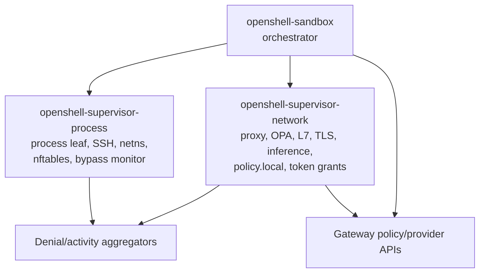
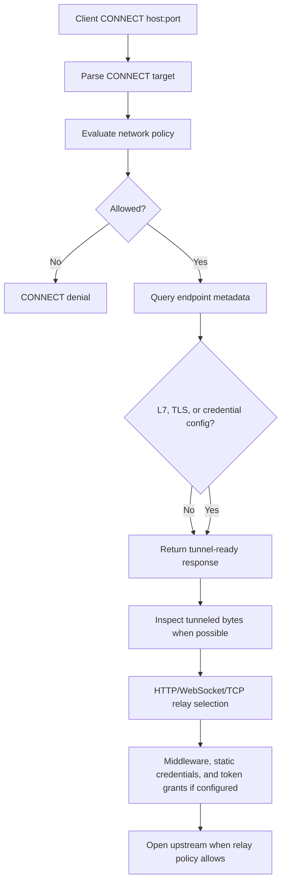
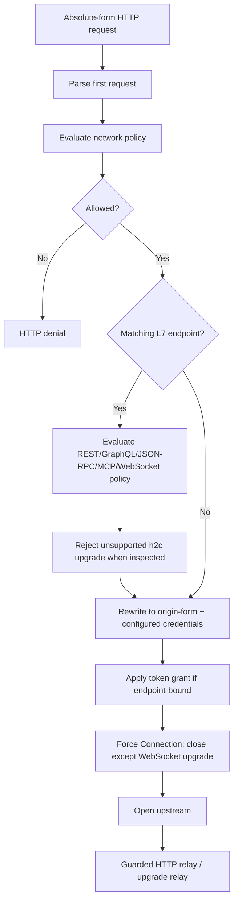
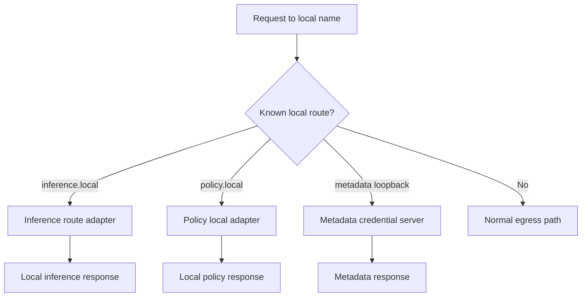
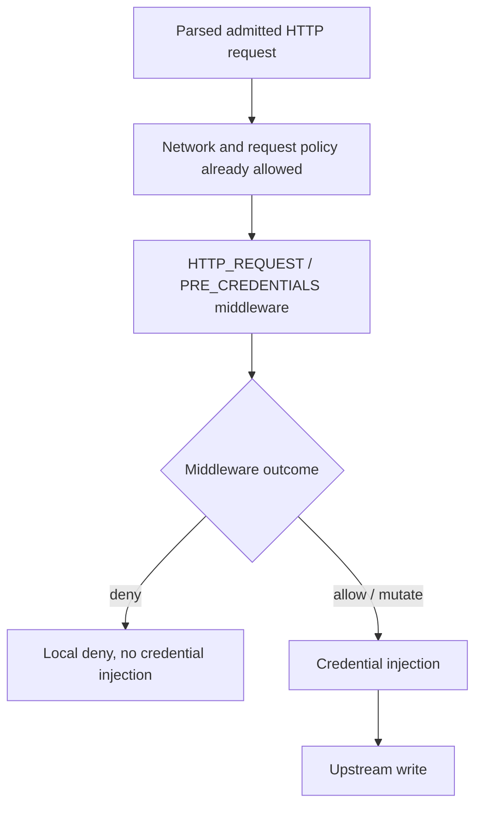
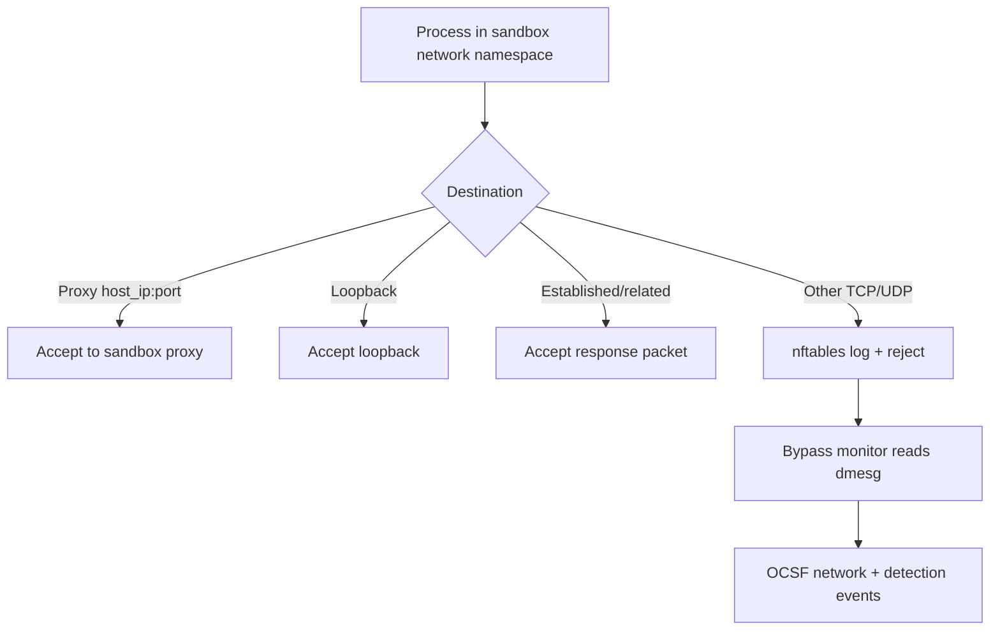

# Current Shape Appendix

This appendix records the current proxy shape and the review findings that
motivate the adapter model. The main RFC intentionally keeps these details out
of the direction document.

## Current Runtime Split

The proxy is no longer only a large module inside `openshell-sandbox`.
Current main has three relevant runtime owners:

`openshell-sandbox` creates the shared network namespace, owns denial/activity
channels, starts the policy poll loop, starts networking, starts the metadata
loopback server when needed, and then optionally starts the process leaf. If
`process_enabled` is false, the supervisor can run in network-only mode and
keep networking/background tasks alive until shutdown.

`openshell-supervisor-network` owns the explicit proxy listener, OPA engine
integration, L7 enforcement, TLS termination, inference routing, policy-local
routes, identity cache, provider credential injection, and token grants.

`openshell-supervisor-process` owns process execution, SSH, network namespace
helpers, nftables bypass rules, and the bypass monitor that turns nftables LOG
entries into OCSF events.

## Current Userland-Facing Surfaces

The networking surface currently includes:

- CONNECT proxy traffic for HTTPS and generic TCP tunnels.
- Forward HTTP proxy traffic for absolute-form HTTP requests.
- `inference.local` for local inference routing.
- `policy.local` for current policy, denial summaries, proposal submission,
  and proposal wait routes.
- GCE metadata loopback for SDKs that bypass HTTP proxy variables.
- nftables bypass enforcement for direct TCP/UDP egress that does not enter
  the proxy.
- OPA/Rego policy and endpoint metadata lookups.
- DNS resolution and endpoint validation for CONNECT and forward HTTP egress.
- Static provider credential injection and redaction.
- Endpoint-bound dynamic token grant injection.
- Opt-in REST request-body credential rewrite.
- L7 REST, GraphQL, JSON-RPC, MCP, WebSocket, and
  GraphQL-over-WebSocket enforcement.

The issue is not that these features exist. The issue is that entry mechanisms,
policy evaluation, endpoint metadata lookup, credential injection, and byte
relay decisions are still interleaved.

## Current CONNECT Shape

CONNECT is still the strongest entry shape because the tunnel relay can keep
parsing HTTP requests on long-lived connections and enforce request policy per
request.

## Current Forward HTTP Shape

Latest main no longer has the old raw-copy-after-first-request shape for
ordinary forward HTTP. It rewrites ordinary requests with `Connection: close`,
uses guarded HTTP relay helpers for body handling, rejects inspected h2c
upgrades, injects token grants, and sends allowed WebSocket upgrades through
the upgrade relay. That is a narrower surface than the historical bidirectional
copy, but it is still orchestrated separately from the CONNECT relay path.

## Current Local Service Shape

`inference.local` now covers buffered and streaming inference shapes including
chat/completion routes, model discovery, embeddings, and provider-specific
routes. `policy.local` supports the agentic approval loop: agents can submit
narrow proposals and wait on approval/reload before retrying. Metadata
loopback exists for provider credentials consumed by SDKs that do not honor
HTTP proxy variables.

These are userland-facing network surfaces. They should stay distinct from
external egress while still fitting the adapter model.

## Adjacent In-Flight Supervisor Middleware Shape

PRs #1738 and #2027 propose supervisor middleware as an HTTP request hook in
the proxy relay. That work is adjacent to this RFC rather than a separate entry
adapter.

The proposed middleware chain is selected by admitted destination host, runs in
deterministic order, buffers bounded request bodies, applies `fail_open` or
`fail_closed`, emits audit-safe findings, and runs before OpenShell-managed
credentials are injected. It can inspect WebSocket upgrade requests because
they are HTTP requests, but it does not inspect post-upgrade WebSocket frames
in v1.

RFC 0005 should account for this by treating middleware as part of the shared
request processing plan. CONNECT and forward HTTP should not each learn how to
select and invoke middleware independently.

## Current Network Namespace Enforcement

The process leaf installs an `inet` nftables filter table for bypass
enforcement. The table accepts proxy-bound traffic, loopback, and established
flows, then rejects and optionally logs other TCP/UDP traffic. It does not
currently redirect native TCP connections into the proxy.

## Findings To Preserve

### Invariant: forward proxy must not relay unevaluated follow-on HTTP bytes

The historical forward path evaluated at most the first absolute-form request,
rewrote it, then switched to bidirectional copy. Bytes already buffered after
the first header block, or later pipelined requests on the same client/upstream
connection, could reach upstream without the CONNECT L7 relay's per-request
parser/evaluator.

Latest main mitigates this by forcing ordinary forward HTTP to one request per
connection and by using guarded relay helpers. The adapter model should
preserve the invariant either by keeping forward HTTP single-request/close or
by passing the first parsed request into a shared HTTP relay loop.

### Endpoint config is not tied to deterministic matched policy

The policy name used for L4 authorization and logging can be selected through a
different precedence rule than endpoint metadata. With overlapping host, port,
and binary rules, allowed IPs, TLS behavior, enforcement, and
`allow_encoded_slash` can come from a different endpoint than the policy name
logged and used for L4 allow.

The adapter model requires authorization to return one decision with one
deterministic matched endpoint.

### Endpoint metadata query failures should not erase enforcement

If endpoint metadata lookup fails, callers can interpret the result as no L7
configuration and downgrade to credential-only or raw L4 relay.

The adapter model treats endpoint metadata as part of the authorization result.
Failure to materialize required metadata should deny rather than erase extended
configuration.

### Destination validation must be shared

Private address checks, `allowed_ips`, exact declared private endpoint trust,
trusted gateway aliases, SSRF checks, and control-plane port blocks have grown
over time. They should be centralized so CONNECT, forward HTTP, future
transparent TCP, and local-service egress use the same resolved-destination
rules.

## Existing Feature Inventory

The refactor should preserve:

- CONNECT explicit proxy support.
- Forward HTTP explicit proxy support.
- Network-only supervisor mode.
- nftables bypass reject/log enforcement.
- Provider credential injection and redaction.
- Dynamic token grant injection through SPIFFE-backed provider credentials.
- Supervisor middleware `HTTP_REQUEST / PRE_CREDENTIALS` when it lands.
- REST request-body credential rewrite.
- WebSocket text-frame credential rewrite.
- REST endpoint method/path policy.
- GraphQL-over-HTTP policy.
- JSON-RPC-over-HTTP method policy.
- MCP Streamable HTTP method and tool policy.
- WebSocket transport and GraphQL-over-WebSocket policy.
- h2c rejection on inspected HTTP routes.
- Inference routing through `inference.local`, including embeddings.
- Agent-facing policy advisor routes through `policy.local`.
- GCE metadata loopback for supported provider credentials.
- Timeout and resource tracking for client, upstream, and local service work.
- Structured OCSF logging for network and HTTP policy outcomes.
- SSRF and internal address protections.
- Exact declared private endpoint handling.
- Control-plane port protection.
- `allowed_ips` endpoint restrictions.
- TLS auto-detection and termination for inspectable client connections.
